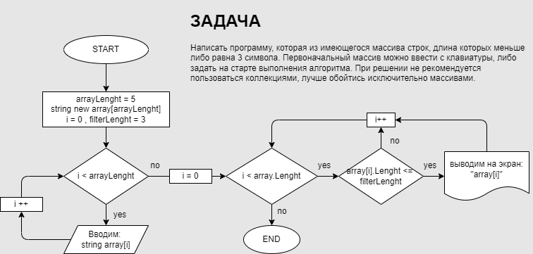

# FirstQuarterWork
## контрольная работа - продакт-менеджер
*интересно - это для всех так или со мной ошиблись? (оплачивал курс проджекта)*

## Задача
1. Создать репозиторий GitHub 
2. Нарисовать блок-схему алгоритма
3. Снабдить репозиторий оформмленным текстовым описанием
4. написать программу, решающую поставленную задачу
5. использовать контроль версий каждого этапа

**Задача:** Написать программу, которая из имеющегося массива строк, длина которых меньше либо равна 3 символа. Первоначальный массив можно ввести с клавиатуры, либо задать на старте выполнения алгоритма. При решении не рекомендуется пользоваться коллекциями, лучше обойтись исключительно массивами.

## Выполнение:
1. [ссылка на репозиторий https://github.com/alexseus/FirstQuarterWork.git](https://github.com/alexseus/FirstQuarterWork.git)
2. 
3. см. выше
4. см файл program.cs в репозитории
5. выполнено.
